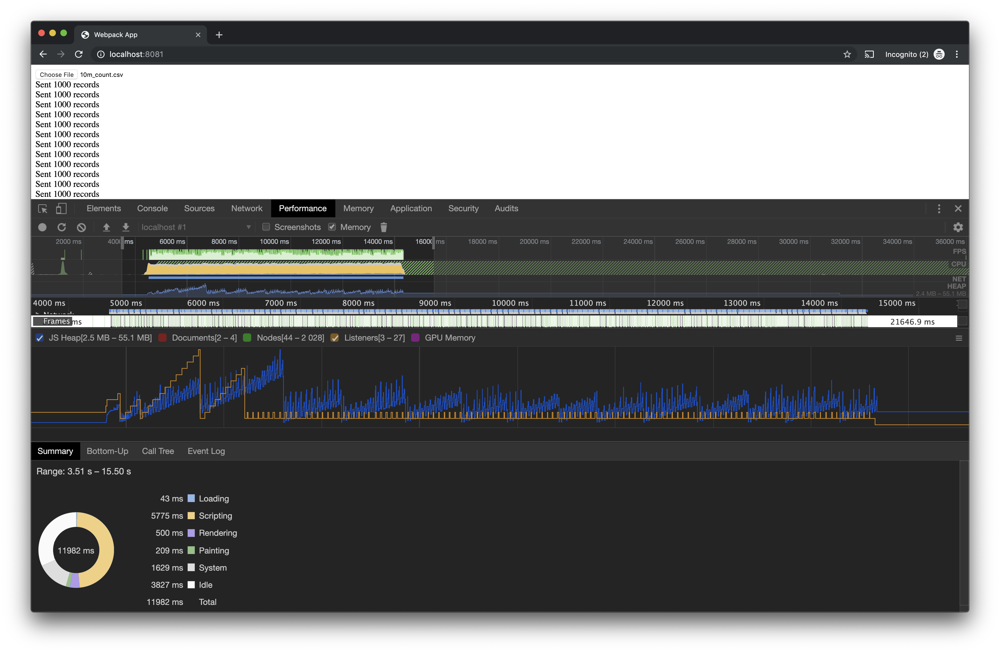

# advanced-streams

Suppose you have a very large CSV file, that you'd like to send to a remote service.

However, the remote service only accepts JSON (not CSV), up to 1,000 records at a time (you have 10's of thousands, perhaps millions), and service's maximum accepted payload size is 10 MiB (your CSV file could be gigabytes).

This problem's solution depends on streams. You can't load the entire CSV file into memory in the browser (without crashing or seriously degrading browser performance). Streams it is, then!


# Tested Against

- IE11
- Firefox, latest
- Chrome, latest
- Safari, latest

# Getting started

```
npm install
npm start
```

# Production Mode

```
npm run build
npm run serve
```

Your browser will automatically open at http://0.0.0.0:8080/.

# How it Works

There's a few notable stream implementations out there, including:

- WHATWG Streams
- Node Streams (V2)
- Node Streams (V1, V3)

Module `filestream` does the heavy lifting of converting the File object (a WHATWG stream) into a Node V2 compatible stream. (Most open source streaming implementations are built to work with Node V2 streams).

After converting to a Node V2 Stream, the stream is piped through the `csvtojson` transformer.

The responsibility of batching the data to the service (per the criteria outlined in the README's introduction) is the responsibility of the `MassCreateQueue` class (see [client.js](client.js)). 

# Perf Metrics



Uploading 1 million records occurs from ~5 to 15 seconds (production build). Garbage collection periodically occurs, suggesting there are no memory leaks.
